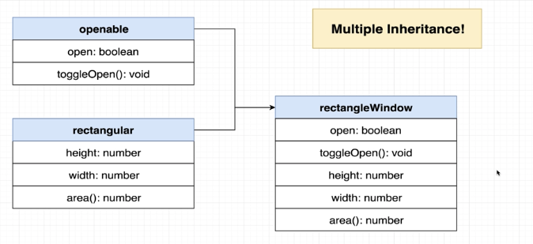

## Interfaces

Une interface ou une classe abstraite permet de définir un contrat entre différentes classes.
Les interfaces vont plutôt être utilisées quand les classes n'ont pas de relations entre elles.

Par exemple:

```
interface User {
  name: string;
  age: number;
  displayName: () => string;
}

interface Company {
  name: string;
  address: string;
}
```

## Classes Abstraites

Une classe abstraite va être utilisée de préférence pour des classes qui sont liées par des notions d'héritage et partagent des méthodes communes.

```
export abstract class Sorter {
  abstract compare(leftIndex: number, rightIndex: number): boolean;
  abstract swap(leftIndex: number, rightIndex: number): void;
  abstract length: number;
  // Do sorting stuff
}

export class NumbersCollection extends Sorter {
  // Implements abstracted methods
  compare(leftIndex: number, rightIndex: number): boolean {
      // Do compare stuff
  }
}

export class CharactersCollection extends Sorter {
  // Implements abstracted methods
  compare(leftIndex: number, rightIndex: number): boolean {
      // Do compare stuff
  }
}
```

## Héritage VS Composition

### Héritage

L'héritage va consister en la création d'une classe abstraite qui va contenir les fonctionnalités partagées par les enfants (core features). Les autres classes devront implémenter ces fonctionnalités.
L'héritage est caractérisé par le fait qu'il EST une relation entre 2 classes car elles possèdent toutes les 2 les différentes méthodes.


Par exemple ici, la classe Mur et Fenêtre possède des caractéristiques communes (hauteur, largeur...). Pour éviter la duplication de code, on peut donc créer une classe parente avec ces caractéristiques.
Les classes Mur et Fenêtre vont "extends" la classe Rectangle.
On peut dire qu'un mur et une fenêtre SONT des rectangles.

Maintenant imaginons que nous ayont une forme de fenêtre différente:


Nous allons devoir créer une nouvelle classe de forme différente.
On peut voir aussi que la fenêtre RectangleWindow et CircleWindow ont des méthodes en communs. Il faut donc créer une classe supplémentaire.
Il faut dans ce cas passer à la composition au lieu de l'héritage.

### Composition

La composition consiste en la création d'interfaces pour décrire les besoins des différentes classes
La composition est caractérisée par le fait qu'il A une relation entre 2 classes.


Dans le cas d'une composition, nous allons donner la référence d'un autre objet qui va matcher une interface "Forme". Quand on initialise la classe Mur, on peut lui donner une référence à la classe Rectangle ou Circle. Et chaque fois que nous allons appeler la méthode area(), au lieu de calculer dans la classe Mur, nous pouvons déléguer le calcul dans la méthode area() de l'objet dimensions (instance de Rectangle ou Cercle).
Même chose pour la fenêtre.


Ne pas confondre "composition" avec "héritage multiple". Ce dernier consiste en la création d'un objet en utilisant plusieurs autres objets:


